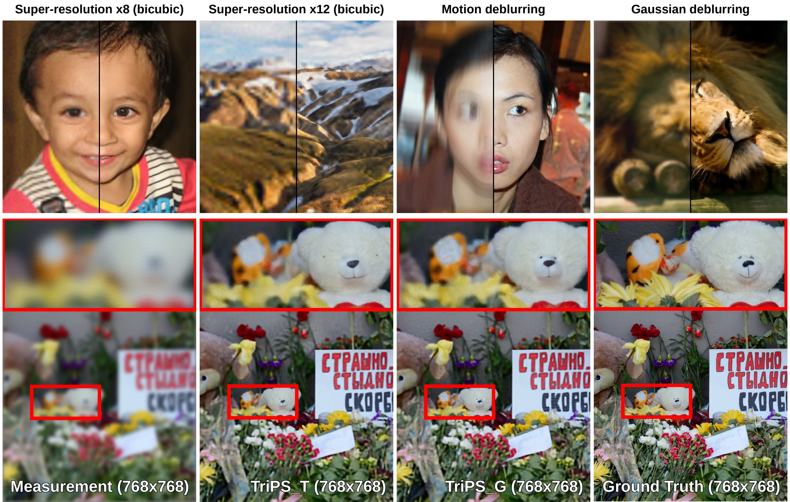

<div align="center">

# [ICML 2026] Triadic Dynamics Aware Diffusion Posterior Sampling for Inverse Problems: Optimizing Guidance and Stochasticity Schedules

**Junseo Bang**<sup>1,\*</sup> · **Dong Ju Mun**<sup>1,\*</sup> · **Hoigi Seo**<sup>1</sup> · **Seongmin Hong**<sup>2</sup> · **Se Young Chun**<sup>1,2,3</sup>

<sup>1</sup>Dept. of Electrical and Computer Engineering &nbsp;·&nbsp; <sup>2</sup>INMC &nbsp;·&nbsp; <sup>3</sup>IPAI &amp; AIIS<br>
Seoul National University, Republic of Korea<br>
<sup>\*</sup>Equal contribution &nbsp;·&nbsp; Correspondence to: Se Young Chun (`sychun@snu.ac.kr`)

[](https://arxiv.org/abs/2605.26470)
[](https://github.com/mundongju/TriPS)
[](LICENSE)

</div>

---

<div align="center">


<em> <b>TriPS</b> is a novel framework for posterior sampling through time-varying coordination of data consistency (DC) guidance, classifier-free guidance (CFG), and stochasticity.</em> 
</div>

---

## Code Structure

```
TriPS/
├── inference.py            # ⭐ unified inference: TriPS-T (template) or TriPS-G (GRPO ckpt)
├── run_inference.sh        # one-command demo on ./demo_images
├── eval.py                 # full-reference metrics (PSNR / SSIM / LPIPS)
├── run_eval_patch.sh       # patch-FID / patch-KID
├── sd3_sampler_total.py    # TriPS-T sampler (template schedules)
├── sd3_sampler_ours_test.py# TriPS-G inference sampler (explicit schedules)
├── demo_images/            # FFHQ (faces) + DIV2K (scenes) + prompts
│
├── TriPS_T/                # TriPS-T grid search → finds the template schedule
└── TriPS_G/                # TriPS-G GRPO training → exports the reference policy
```

Shared modules (`grpo_schedule.py`, `util.py`, `cores/`, `functions/`, …) live at the **root**; the runner scripts add the root to `PYTHONPATH` automatically.

---

## Setup

```bash
git clone https://github.com/mundongju/TriPS.git
cd TriPS
conda env create -f TriPS.yaml -n TriPS
conda activate TriPS
```

SD3.5-M is fetched from the Hugging Face Hub on first run (`huggingface-cli login` may be needed).

**Single-GPU (24 GB) inference.** Pass `--efficient_memory`: the text encoder pre-computes the text embeddings and is then removed from the GPU, so the whole inverse problem can be solved on a single GPU with **24 GB of VRAM**.

---

## 🚀 Inference (start here)

Run a **fixed, already-found schedule** on the demo images. Tasks: `0`=SR×8, `1`=Gaussian deblur, `2`=motion deblur.

```bash
# TriPS-T  (training-free template schedule)
bash run_inference.sh TriPS-T 0

# TriPS-G  (GRPO-based learned schedule; needs a trained checkpoint)
GRPO_CKPT=/path/to/grpo_schedule_ckpt_sr_bicubic_itXXXX.pt bash run_inference.sh TriPS-G 0
```

Or call `inference.py` directly:

```bash
python inference.py --method TriPS-T --dataset DIV2K --task sr_bicubic \
    --img_path demo_images/DIV2K --prompt_file demo_images/DIV2K/DIV2K_prompts_demo.txt \
    --workdir results/TriPS-T/srx8 --efficient_memory

python inference.py --method TriPS-G --task sr_bicubic --operator_imp SVD --deg_scale 8 \
    --img_path demo_images/DIV2K --prompt_file demo_images/DIV2K/DIV2K_prompts_demo.txt \
    --grpo_ckpt /path/to/ckpt.pt --workdir results/TriPS-G/srx8 --efficient_memory
```

- **TriPS-T**: `--dataset {DIV2K,FFHQ} --task {sr_bicubic,deblur_gauss,deblur_motion}` selects the paper's confirmed template schedule (override with `--function_dc/_cfg/_sto`, `--step_scale`, `--step_scale_2`).
- **TriPS-G**: `--grpo_ckpt` is a checkpoint from TriPS-G training; its `cfg/step/eta` curves are read from the policy.

Results: `results/<method>/<task>/{recon,label,input1,...}` + `eval_results.txt`.

---

## Supported tasks &amp; baselines

**Tasks** (`--task`). Tasks in **bold** are the ones reported in our main paper; the rest are additionally reported in Appendix.

| Task | `--task` flag |
|---|---|
| Super-resolution (bicubic) | **`sr_bicubic`** |
| Gaussian deblurring | **`deblur_gauss`** |
| Motion deblurring | **`deblur_motion`** |
| Inpainting (FFHQ) | `inpainting` |
| Inpainting (DIV2K) | `inpainting_DIV2K` |

**Baseline methods.** The following baselines are available for comparison: `flowdps`, `flowchef`, `resample`, `flower`. See [`sd3_sampler_TriPS_T.py`](sd3_sampler_TriPS_T.py) for how each baseline sampler is selected and configured.

---

## How to do Triadic Schedule Optimization (TriPS-T & TriPS-G)

**TriPS-T (find template schedules → Excel).** Grid-searches `linear/log/exp` priors and logs an `eval_score` per run:
```bash
cd TriPS_T && bash run_search.sh 0      # see TriPS_T/README.md
```

**TriPS-G (train the GRPO-based learned schedule).** Initialized from the TriPS-T reference policy:
```bash
cd TriPS_G
python build_init_schedules.py --verify   # TriPS-T schedules → init_load_file_fin/*.npz
bash run_train.sh 1                        # see TriPS_G/README.md
```

---

## Evaluation

### Patch-based distributional metrics (patch-FID / patch-KID)

```bash
bash run_eval_patch.sh fid results/TriPS-T/sr_bicubic/label results/TriPS-T/sr_bicubic/recon 256
bash run_eval_patch.sh kid results/TriPS-T/sr_bicubic/label results/TriPS-T/sr_bicubic/recon 192
```

### Full-reference metrics (PSNR / SSIM / LPIPS) — `eval.py`

`eval.py` exposes a unified set of metric tags. Pass one or more to `--metric` (`--path1` = reconstruction dir, `--path2` = ground-truth / label dir):

```bash
# PSNR, SSIM
python eval.py --path1 results/TriPS-T/sr_bicubic/recon \
               --path2 results/TriPS-T/sr_bicubic/label \
               --metric psnr ssim

# LPIPS (both protocols at once)
python eval.py --path1 results/TriPS-T/sr_bicubic/recon \
               --path2 results/TriPS-T/sr_bicubic/label \
               --metric lpips_FLAIR lpips_FlowDPS
```

**LPIPS protocols — what's the difference?** Both use LPIPS(VGG); they differ only in the resize policy before scoring, so that our numbers are directly comparable to each prior work's reported protocol:

| Tag | Resize before LPIPS | Comparable to |
|---|---|---|
| `lpips_FLAIR` (= `lpips_flair`) | none, scored at **full resolution** | [FLAIR](https://github.com/prs-eth/FLAIR/) |
| `lpips_FlowDPS` (= `lpips_flowdps`) | images resized to **224×224** | [FlowDPS](https://github.com/FlowDPS-Inverse/FlowDPS/tree/main) |

> Use `lpips_FLAIR` to match the FLAIR evaluation protocol and `lpips_FlowDPS` to match the FlowDPS protocol; the two casings (`lpips_FLAIR`/`lpips_flair`, `lpips_FlowDPS`/`lpips_flowdps`) are registered identically.

**Paper setup.** SD3.5-M, 28 NFE, noise `σ_n=0.03`, 1000 FFHQ / 800 DIV2K; SR ×8/×12 (bicubic), motion deblur (61×61, intensity 0.5), Gaussian deblur (σ=3.0). Metrics: PSNR / SSIM / FID / LPIPS.

---

## Citation

```bibtex
@misc{bang2026triadicdynamicsawarediffusion,
  title         = {Triadic Dynamics Aware Diffusion Posterior Sampling for Inverse
                   Problems: Optimizing Guidance and Stochasticity Schedules},
  author        = {Junseo Bang and Dong Ju Mun and Hoigi Seo and Seongmin Hong and Se Young Chun},
  year          = {2026},
  eprint        = {2605.26470},
  archivePrefix = {arXiv},
  primaryClass  = {cs.CV},
  url           = {https://arxiv.org/abs/2605.26470}
}
```

## Acknowledgements &amp; License

Builds on [FlowDPS](https://github.com/FlowDPS-Inverse/FlowDPS), [Stable Diffusion 3.5](https://huggingface.co/stabilityai/stable-diffusion-3.5-medium) (🤗 `diffusers`), and [motionblur](https://github.com/LeviBorodenko/motionblur). Code released under the [MIT License](LICENSE); SD3.5 weights follow the Stability AI Community License.
